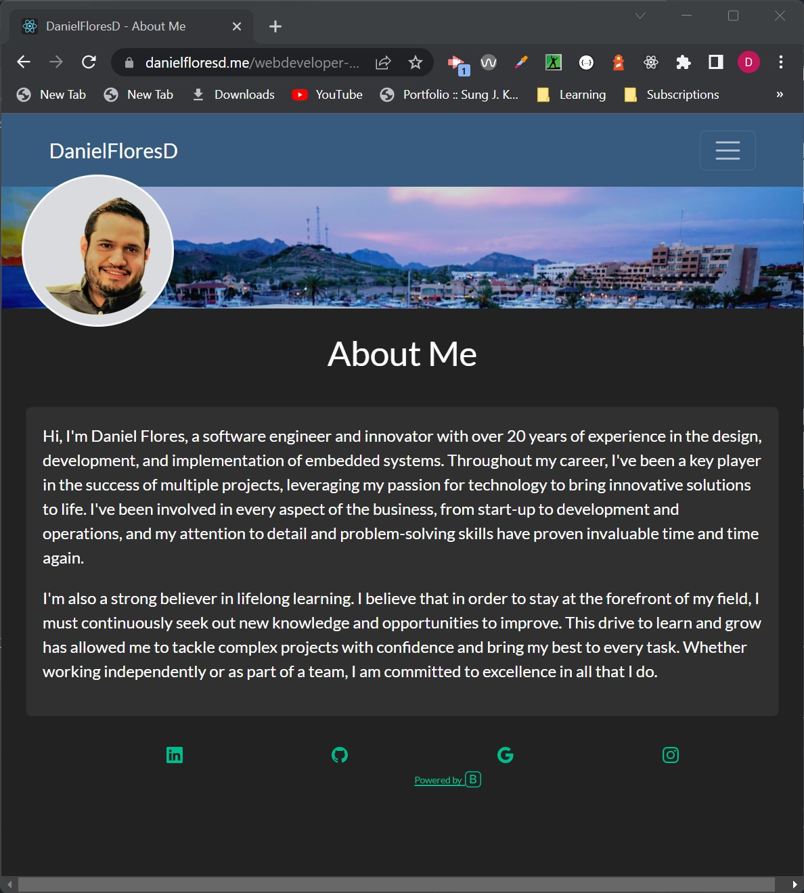

[](https://deepscan.io/dashboard#view=project&tid=19657&pid=23124&bid=691436)[](https://www.codefactor.io/repository/github/danielflores/demployee-track-cms)

# Webdeveloper Portfolio Plus

## Description

Developer portfolio implemented using React and Bootswatch



## Table of contents

- [Description](#description)
- [Installation](#🛠️installation)
- [Usage](#💻usage)
- [Dependencies](#🧩dependencies)
- [License](#📛license)
- [Contributing](#🤝contributing)
- [Tests](#📃tests)
- [Questions](#❓questions)
- [Website](#🌐website)
- [Programming Languages](#👨‍💻programming-languages)
- [Credits](#👨creadits)

## 🛠️Installation

To install the application clone the repository https://github.com/danielfloresd/webdeveloper-portfolio-plus and run node package manager with the following command: ```npm i```.

## 💻Usage

### `npm start`

Runs the app in the development mode.\
Open [http://localhost:3000](http://localhost:3000) to view it in your browser.

The page will reload when you make changes.\
You may also see any lint errors in the console.

### `npm test`

Launches the test runner in the interactive watch mode.\
See the section about [running tests](https://facebook.github.io/create-react-app/docs/running-tests) for more information.

### `npm run build`

Builds the app for production to the `build` folder.\
It correctly bundles React in production mode and optimizes the build for the best performance.

The build is minified and the filenames include the hashes.\
Your app is ready to be deployed!

See the section about [deployment](https://facebook.github.io/create-react-app/docs/deployment) for more information.

### `npm run deploy`

Deploys app to gh-pages

## 🧩Dependencies
*   "fontawesome": "^6.3.0"
*   "bootstrap": "^5.1.3"
*   "bootswatch": "^5.2.3"
*   "gh-pages": "^5.0.0"
*   "lodash": "^4.17.21"
*   "popper": "^1.0.1"
*   "react": "^18.2.0"
*   "react-bootstrap": "^2.7.1"
*   "react-scripts": "5.0.1"

## 📛License

Project license: [MIT](https://choosealicense.com/licenses/mit).

<details><summary><b>View License</b></summary>MIT License

Copyright (c) 2022 Daniel Flores D

Permission is hereby granted, free of charge, to any person obtaining a copy
of this software and associated documentation files (the "Software"), to deal
in the Software without restriction, including without limitation the rights
to use, copy, modify, merge, publish, distribute, sublicense, and/or sell
copies of the Software, and to permit persons to whom the Software is
furnished to do so, subject to the following conditions:

The above copyright notice and this permission notice shall be included in all
copies or substantial portions of the Software.

THE SOFTWARE IS PROVIDED "AS IS", WITHOUT WARRANTY OF ANY KIND, EXPRESS OR
IMPLIED, INCLUDING BUT NOT LIMITED TO THE WARRANTIES OF MERCHANTABILITY,
FITNESS FOR A PARTICULAR PURPOSE AND NONINFRINGEMENT. IN NO EVENT SHALL THE
AUTHORS OR COPYRIGHT HOLDERS BE LIABLE FOR ANY CLAIM, DAMAGES OR OTHER
LIABILITY, WHETHER IN AN ACTION OF CONTRACT, TORT OR OTHERWISE, ARISING FROM,
OUT OF OR IN CONNECTION WITH THE SOFTWARE OR THE USE OR OTHER DEALINGS IN THE
SOFTWARE.

</details></br>

## 🤝Contributing

If you would like to contribute, please follow the [GitHub contribution guidelines](https://github.com/github/docs/blob/main/CONTRIBUTING.md)

## 📃Tests

Testing implemented using jest. To run unit testing ```npm test```

## ❓Questions

For questions, please contact:

- [](https://github.com/danielfloresd)
- [](mailto:daniel.flor3s.d@gmail.com)


## 🌐Website

[Portfolio](https://danielfloresd.me/webdeveloper-portfolio-plus/)


## 👨‍💻Programming Languages

This project was created with: JavaScript and Webpack

## 👨Credits

Started code provided by the University of Arizona coding bootcamp
